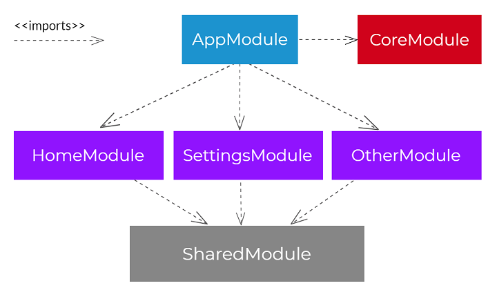

# Odigeo Tech Challenge

This is a project based on Edreams tech challenge source code which provides two endpoints for locations and itineraries data.

## Features

- Search itineraries based on departure and arrival location.
- List results within a table format.

## Project Structure

This app is stuctured the following way:


## Misc

I have used primeng as a component library.

## Installation

It runs angular 13.
Install the dependencies and devDependencies and start the server with the following commands:
For backend:

```sh
cd travel-application-backend
npm i
npm start
```

For frontend

```sh
cd travel-application-frontend
npm i
npm run build
```

You can access through express port which is serving angular compiled static files.
